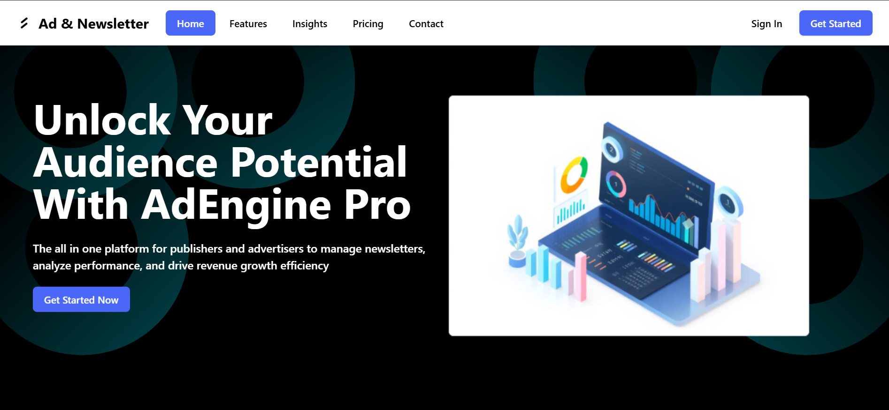
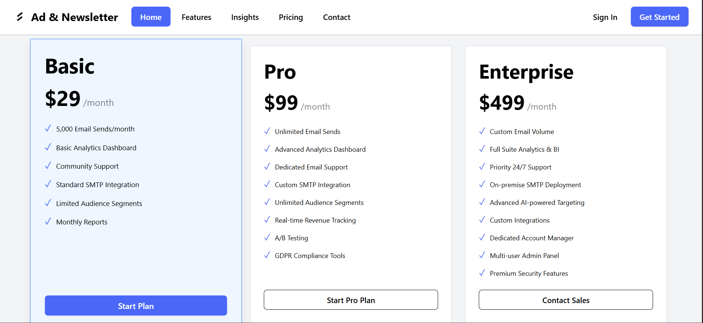

🖋️ Project Overview

The Ad and Newsletter Platform Landing Page is a clean, responsive one-page website designed to showcase a digital advertising and newsletter management platform.
It highlights the product’s features, pricing plans, and call-to-action areas with a modern, minimal aesthetic.

🚀 Features

Fully responsive layout

Elegant hero section with CTA button

Feature highlight grid cards

Pricing section with selectable plans

Footer sections

Built with accessibility and performance in mind

🛠️ Tech Stack

React (Vite) — for fast, modular UI

Tailwind CSS — for utility-first responsive styling

Shadcn UI — for reusable, elegant components

Lucide Icons — for simple, scalable icons

Deployed on Vercel

🧱 Project Structure

src/

 ├── home components/

 │   ├── Nav.tsx

 │   ├── Hero.tsx

 │   ├── Features.tsx

 │   ├── Platform.tsx

 │   ├── PricingSection.tsx

 │   ├── Contact.tsx

 │   └── Footer.tsx

 ├── App.tsx

 └── main.tsx

🌍 Live Demo

🔗 View on Vercel

 (Add your deployment link here)

📸 Preview

💡 Future Improvements

Add smooth scroll animations

Connect newsletter form to backend API

Add dark/light mode toggle